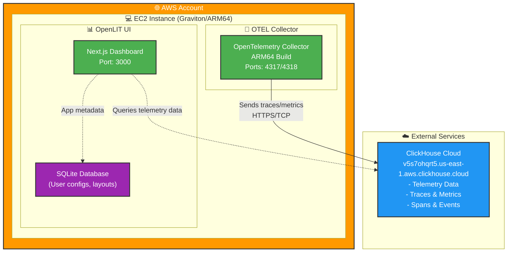

# RFC: OpenLIT Deployment on AWS EC2 with Graviton Instances

**Document Version**: 1.0
**Date**: August 2025
**Status**: Draft
**Authors**: Stas German <stas.german@gmail.com>

## Executive Summary

This RFC proposes deploying OpenLIT AI observability platform on AWS EC2 using Graviton instances for a cost-effective demo environment. The deployment leverages Infrastructure as Code (Terraform), existing ClickHouse Cloud setup, and containerized architecture for simplified management.

## Background & Requirements

### Business Context
- **Target**: Demo environment for potential client demonstration
- **Traffic Profile**: Low volume, non-critical workload
- **Database**: Existing ClickHouse Cloud infrastructure (already configured)
- **Cost Optimization**: AWS Graviton instances preferred for price-performance
- **Deployment Model**: Single-instance containerized deployment

### Technical Requirements
- ARM64 compatibility for Graviton instances
- Integration with existing ClickHouse Cloud (v5s7ohqrt5.us-east-1.aws.clickhouse.cloud)
- Docker Compose orchestration
- Infrastructure as Code using Terraform
- Automated deployment and health checks
- Demo account pre-configuration

## Architecture Overview



## Infrastructure Design

### Recommended Instance Configuration

**Primary Choice**: `t4g.small`
- **Specs**: 2 vCPU, 2 GiB RAM, ARM64 Graviton2
- **Cost**: ~$13.14/month (us-east-1)
- **Use Case**: Perfect for demo workloads with OpenLIT's dual-database architecture

**Alternative**: `t4g.medium` (if higher memory needed)
- **Specs**: 2 vCPU, 4 GiB RAM
- **Cost**: ~$26.28/month

### Directory Structure

```
/Users/sgerman/Code/openlit/
├── infrastructure/
│   ├── aws/
│   │   ├── demo/
│   │   │   ├── main.tf
│   │   │   ├── variables.tf
│   │   │   ├── outputs.tf
│   │   │   ├── versions.tf
│   │   │   ├── terraform.tfvars.example
│   │   │   ├── terraform.tfvars      # Gitignored
│   │   │   └── user-data.sh
│   │   ├── modules/
│   │   │   ├── ec2-openlit/
│   │   │   └── security-group/
│   │   └── environments/
│   │       ├── demo.tfvars
│   │       └── staging.tfvars
│   ├── scripts/
│   │   ├── deploy.sh
│   │   ├── health-check.sh
│   │   └── destroy.sh
│   └── docs/
└── ...existing OpenLIT code...
```

## Implementation Details

### Prerequisites

Before implementing this RFC, ensure the following prerequisites are met:

#### AWS Environment
- **AWS Account**: Active AWS account with appropriate permissions
- **AWS CLI**: Version 2.x installed and configured with credentials
  ```bash
  aws configure
  # Verify with: aws sts get-caller-identity
  ```
- **IAM Permissions**: User/role must have permissions for:
  - EC2 (create instances, security groups, key pairs)
  - VPC (if creating custom VPC)
  - ECR (create repositories, push/pull images)
  - EBS (create/manage volumes)
  - Route53 (if using custom domains)

#### Local Development Environment
- **Terraform**: Version >= 1.0 installed
  ```bash
  terraform --version
  ```
- **Docker**: Docker Desktop with buildx support
  ```bash
  docker --version
  docker buildx version
  ```
- **Git**: Access to OpenLIT repository
- **SSH Key Pair**: AWS EC2 key pair for instance access

#### Project Setup
- **Repository Access**: Clone the OpenLIT repository to `/Users/sgerman/Code/openlit`
- **ClickHouse Cloud**: Existing ClickHouse Cloud instance configured (v5s7ohqrt5.us-east-1.aws.clickhouse.cloud)
- **Environment Variables**: ClickHouse credentials and connection details available

#### Verification Commands
```bash
# Verify all prerequisites
aws --version && echo "✅ AWS CLI"
terraform --version && echo "✅ Terraform"
docker --version && echo "✅ Docker"
docker buildx version && echo "✅ Docker Buildx"
aws sts get-caller-identity && echo "✅ AWS Authentication"
```

### Terraform Configuration

**Main Infrastructure** (`infrastructure/aws/demo/main.tf`):
```hcl
terraform {
  required_version = ">= 1.0"
  required_providers {
    aws = {
      source  = "hashicorp/aws"
      version = "~> 5.0"
    }
  }
}

provider "aws" {
  region = var.aws_region

  default_tags {
    tags = {
      Project     = "OpenLIT"
      Environment = var.environment
      ManagedBy   = "Terraform"
    }
  }
}

module "openlit_demo" {
  source = "../modules/ec2-openlit"

  environment     = var.environment
  instance_type   = var.instance_type
  key_pair_name   = var.key_pair_name
  allowed_cidr    = var.allowed_cidr

  clickhouse_config = {
    host     = var.clickhouse_host
    port     = var.clickhouse_port
    database = var.clickhouse_database
    username = var.clickhouse_username
    password = var.clickhouse_password
  }

  otel_config = {
    host   = var.otel_host
    port   = var.otel_port
    secure = var.otel_secure
  }

  demo_accounts = {
    emails    = var.demo_emails
    passwords = var.demo_passwords
  }
}
```

**Environment Configuration** (`terraform.tfvars`):
```hcl
# Infrastructure
aws_region    = "us-east-1"
environment   = "demo"
instance_type = "t4g.small"
key_pair_name = "your-key-pair-name"
allowed_cidr  = "YOUR.IP.ADDRESS/32"

# Container Configuration
aws_account_id    = "123456789012"  # Your AWS Account ID
ecr_repository    = "openlit-vostok"
image_tag         = "latest"

# ClickHouse Configuration (from existing .env)
clickhouse_host     = "https://v5s7ohqrt5.us-east-1.aws.clickhouse.cloud"
clickhouse_port     = "8443"
clickhouse_database = "openlit"
clickhouse_username = "default"
clickhouse_password = "HZqNl2H~dpl5x"

# OTEL Configuration
otel_host   = "v5s7ohqrt5.us-east-1.aws.clickhouse.cloud"
otel_port   = "9440"
otel_secure = true

# Demo Accounts
demo_emails    = "stas.german@gmail.com,dutov.vv@vostokit.ru"
demo_passwords = "MikMeusSatan123!,KFj8!sdf3@df"
```

### Container Configuration

**Custom Build Pipeline** (`infrastructure/scripts/build-and-push.sh`):
```bash
#!/bin/bash
set -e

# Configuration
AWS_REGION="us-east-1"
AWS_ACCOUNT_ID="$(aws sts get-caller-identity --query Account --output text)"
ECR_REPOSITORY="openlit-vostok"
IMAGE_TAG="${1:-latest}"

echo "🏗️ Building and pushing custom OpenLIT image..."

# Create ECR repository if it doesn't exist
aws ecr describe-repositories --repository-names $ECR_REPOSITORY --region $AWS_REGION 2>/dev/null || \
    aws ecr create-repository --repository-name $ECR_REPOSITORY --region $AWS_REGION

# Get ECR login token
aws ecr get-login-password --region $AWS_REGION | \
    docker login --username AWS --password-stdin $AWS_ACCOUNT_ID.dkr.ecr.$AWS_REGION.amazonaws.com

# Build multi-architecture image
cd /Users/sgerman/Code/openlit

# Build for ARM64 (Graviton)
docker buildx build \
    --platform linux/arm64 \
    --file src/client/Dockerfile \
    --tag $AWS_ACCOUNT_ID.dkr.ecr.$AWS_REGION.amazonaws.com/$ECR_REPOSITORY:$IMAGE_TAG-arm64 \
    --push \
    src/client/

# Build for AMD64 (fallback)
docker buildx build \
    --platform linux/amd64 \
    --file src/client/Dockerfile \
    --tag $AWS_ACCOUNT_ID.dkr.ecr.$AWS_REGION.amazonaws.com/$ECR_REPOSITORY:$IMAGE_TAG-amd64 \
    --push \
    src/client/

# Create and push manifest for multi-arch support
docker manifest create \
    $AWS_ACCOUNT_ID.dkr.ecr.$AWS_REGION.amazonaws.com/$ECR_REPOSITORY:$IMAGE_TAG \
    $AWS_ACCOUNT_ID.dkr.ecr.$AWS_REGION.amazonaws.com/$ECR_REPOSITORY:$IMAGE_TAG-arm64 \
    $AWS_ACCOUNT_ID.dkr.ecr.$AWS_REGION.amazonaws.com/$ECR_REPOSITORY:$IMAGE_TAG-amd64

docker manifest push $AWS_ACCOUNT_ID.dkr.ecr.$AWS_REGION.amazonaws.com/$ECR_REPOSITORY:$IMAGE_TAG

echo "✅ Custom OpenLIT image pushed to ECR"
echo "🐳 Image: $AWS_ACCOUNT_ID.dkr.ecr.$AWS_REGION.amazonaws.com/$ECR_REPOSITORY:$IMAGE_TAG"
```

**ECR-based Docker Compose** (`docker-compose.aws.yml`):
```yaml
services:
  openlit:
    image: ${AWS_ACCOUNT_ID}.dkr.ecr.${AWS_REGION}.amazonaws.com/openlit-vostok:${IMAGE_TAG:-latest}
    platform: linux/arm64
    environment:
      - TELEMETRY_ENABLED=${TELEMETRY_ENABLED:-true}
      - INIT_DB_HOST=${INIT_DB_HOST}
      - INIT_DB_PORT=${INIT_DB_PORT}
      - INIT_DB_DATABASE=${INIT_DB_DATABASE:-openlit}
      - INIT_DB_USERNAME=${INIT_DB_USERNAME:-default}
      - INIT_DB_PASSWORD=${INIT_DB_PASSWORD}
      - SQLITE_DATABASE_URL=file:/app/client/data/data.db
      - PORT=${PORT:-3000}
      - DOCKER_PORT=${PORT:-3000}
      - DEMO_ACCOUNT_EMAIL=${DEMO_ACCOUNT_EMAIL}
      - DEMO_ACCOUNT_PASSWORD=${DEMO_ACCOUNT_PASSWORD}
    ports:
      - "${PORT:-3000}:${DOCKER_PORT:-3000}"
    volumes:
      - openlit-data:/app/client/data
    restart: always

  otel-collector:
    image: otel/opentelemetry-collector-contrib:0.94.0
    platform: linux/arm64
    environment:
      - OTEL_DB_HOST=${OTEL_DB_HOST}
      - OTEL_DB_PORT=${OTEL_DB_PORT}
      - INIT_DB_DATABASE=${INIT_DB_DATABASE:-openlit}
      - INIT_DB_USERNAME=${INIT_DB_USERNAME:-default}
      - INIT_DB_PASSWORD=${INIT_DB_PASSWORD}
    ports:
      - "4317:4317"
      - "4318:4318"
      - "8888:8888"
      - "55679:55679"
    volumes:
      - ./assets/otel-collector-config.yaml:/etc/otelcol-contrib/config.yaml
    restart: always

volumes:
  openlit-data:
```

**GitHub Actions CI/CD** (`.github/workflows/build-aws.yml`):

> **Note**: GitHub Actions CI/CD pipeline implementation is out of scope for this RFC. This section will be detailed in a separate documentation focused on continuous integration and deployment workflows.

```yaml
name: Build and Push to AWS ECR

on:
  push:
    branches: [ main, develop ]
    paths: [ 'src/client/**' ]
  pull_request:
    branches: [ main ]
  workflow_dispatch:
    inputs:
      image_tag:
        description: 'Docker image tag'
        required: false
        default: 'latest'

env:
  AWS_REGION: us-east-1
  ECR_REPOSITORY: openlit-vostok

jobs:
  build-and-push:
    runs-on: ubuntu-latest
    permissions:
      id-token: write
      contents: read

    steps:
    - name: Checkout code
      uses: actions/checkout@v4

    - name: Configure AWS credentials
      uses: aws-actions/configure-aws-credentials@v4
      with:
        role-to-assume: ${{ secrets.AWS_ROLE_ARN }}
        aws-region: ${{ env.AWS_REGION }}

    - name: Set up Docker Buildx
      uses: docker/setup-buildx-action@v3

    - name: Login to Amazon ECR
      id: login-ecr
      uses: aws-actions/amazon-ecr-login@v2

    - name: Build and push Docker image
      env:
        ECR_REGISTRY: ${{ steps.login-ecr.outputs.registry }}
        IMAGE_TAG: ${{ github.event.inputs.image_tag || github.sha }}
      run: |
        cd src/client

        # Build multi-arch image
        docker buildx build \
          --platform linux/amd64,linux/arm64 \
          --file Dockerfile \
          --tag $ECR_REGISTRY/$ECR_REPOSITORY:$IMAGE_TAG \
          --tag $ECR_REGISTRY/$ECR_REPOSITORY:latest \
          --push .

        echo "🐳 Image pushed: $ECR_REGISTRY/$ECR_REPOSITORY:$IMAGE_TAG"
```

## Security Framework

### Network Security
- **Security Groups**: Restrict access to specific ports (22, 3000, 4317-4318)
- **CIDR Restrictions**: Lock down to specific IP addresses
- **SSH Access**: Key-based authentication only

### Data Security
- **Environment Variables**: Sensitive data via Terraform variables (marked sensitive)
- **EBS Encryption**: Root volume encrypted by default
- **Connection Security**: TLS to ClickHouse Cloud

### Access Control
```hcl
resource "aws_security_group" "openlit" {
  name_prefix = "openlit-demo-"

  ingress {
    from_port   = 22
    to_port     = 22
    protocol    = "tcp"
    cidr_blocks = [var.allowed_cidr]  # Restrict to your IP
  }

  ingress {
    from_port   = 3000
    to_port     = 3000
    protocol    = "tcp"
    cidr_blocks = [var.allowed_cidr]  # OpenLIT UI
  }

  ingress {
    from_port   = 4317
    to_port     = 4318
    protocol    = "tcp"
    cidr_blocks = [var.allowed_cidr]  # OTEL endpoints
  }
}
```

## Cost Analysis

### Monthly Operating Costs (us-east-1)

| Component | Specification | Monthly Cost |
|-----------|--------------|--------------|
| EC2 t4g.small | 2 vCPU, 2GB RAM | $13.14 |
| EBS gp3 Storage | 20GB encrypted | $1.60 |
| Elastic IP | Static IP address | $3.65 |
| Data Transfer | Minimal usage | $0.50 |
| **Total** | | **~$18.89/month** |

### Cost Optimization Features
- **Graviton Instances**: 20% better price-performance vs x86
- **gp3 EBS**: More cost-effective than gp2
- **Right-sizing**: t4g.small sufficient for demo workload
- **External Database**: No RDS costs (using existing ClickHouse Cloud)

## Deployment Workflow

### ECR Repository Setup (One-time)
```bash
# Create ECR repository for custom OpenLIT images
aws ecr create-repository \
    --repository-name openlit-vostok \
    --region us-east-1

# Get repository URI for reference
aws ecr describe-repositories \
    --repository-names openlit-vostok \
    --region us-east-1 \
    --query 'repositories[0].repositoryUri' \
    --output text
```

### Initial Setup (One-time)
```bash
# 1. Clone repository and navigate to infrastructure
cd /Users/sgerman/Code/openlit
git pull origin main

# 2. Set up Docker Buildx for multi-arch builds
docker buildx create --use

# 3. Configure AWS CLI
aws configure
# Enter your AWS credentials

# 4. Configure environment
cd infrastructure/aws/demo
cp terraform.tfvars.example terraform.tfvars
# Edit terraform.tfvars with your values including AWS_ACCOUNT_ID

# 5. Build and deploy
cd ../../scripts
./deploy.sh

# 6. Verify deployment
./health-check.sh
```

### Development Workflow
```bash
# After making changes to OpenLIT source code:

# 1. Build and test locally (optional)
cd /Users/sgerman/Code/openlit
docker-compose up -d  # Test local changes

# 2. Build and push to ECR
cd infrastructure/scripts
./build-only.sh dev-$(date +%Y%m%d)

# 3. Update deployment with new image
cd ../aws/demo
# Update terraform.tfvars with new image_tag
terraform plan -var="image_tag=dev-$(date +%Y%m%d)" -var-file="terraform.tfvars"
terraform apply -var="image_tag=dev-$(date +%Y%m%d)" -var-file="terraform.tfvars"

# 4. Verify changes
cd ../../scripts
./health-check.sh
```

### Daily Operations
```bash
# Check status
cd infrastructure/scripts
./health-check.sh

# SSH to instance
ssh -i your-key.pem ec2-user@$(cd ../aws/demo && terraform output -raw instance_public_ip)

# View logs
sudo docker-compose -f /home/ec2-user/openlit/docker-compose.yml logs -f

# Restart services
sudo docker-compose -f /home/ec2-user/openlit/docker-compose.yml restart
```

### Cleanup
```bash
cd infrastructure/aws/demo
terraform destroy -var-file="terraform.tfvars" -auto-approve
```

## Monitoring & Maintenance

### Health Monitoring
- **Automated Health Checks**: Built into deployment script
- **Service Status**: SystemD service ensures auto-restart
- **Container Health**: Docker Compose health checks
- **Application Health**: OpenLIT UI connectivity validation

### Maintenance Windows
- **Security Updates**: Automated via user-data script
- **Application Updates**: `git pull && docker-compose pull && docker-compose up -d`
- **Backup Strategy**: SQLite database backup to local volume

### Troubleshooting Guide
```bash
# Common issues and solutions
# 1. Services not starting
sudo systemctl status openlit.service
sudo journalctl -u openlit.service -f

# 2. ClickHouse connectivity
curl -v https://v5s7ohqrt5.us-east-1.aws.clickhouse.cloud:8443

# 3. Container issues
docker-compose ps
docker-compose logs openlit
docker-compose logs otel-collector

# 4. Resource constraints
free -h
df -h
top
```

## Definition of Done (DoD)

### Overall Project DoD
The OpenLIT AWS EC2 deployment is complete when:
- [ ] OpenLIT UI accessible at `http://<elastic-ip>:3000`
- [ ] OTEL Collector receiving telemetry on ports 4317/4318
- [ ] ClickHouse Cloud connectivity established and validated
- [ ] Demo accounts functional (`stas.german@gmail.com`, `dutov.vv@vostokit.ru`)
- [ ] Telemetry data visible in dashboards
- [ ] System stable for 24+ hours continuous operation
- [ ] Health checks passing consistently
- [ ] Client demo environment ready within 30 minutes of deployment
- [ ] Monthly costs under $25/month
- [ ] Zero manual intervention required post-deployment
- [ ] Easy cleanup process for temporary demos

### Phase 1 DoD: Infrastructure Setup
This phase is complete when:
- [ ] Directory structure created as per RFC specification
- [ ] Terraform modules created (`ec2-openlit`, `security-group`)
- [ ] Main infrastructure configuration (`main.tf`) implemented
- [ ] Variables configuration (`variables.tf`) defined with all required parameters
- [ ] Outputs configuration (`outputs.tf`) provides instance IP and SSH command
- [ ] `terraform.tfvars.example` template created with all necessary variables
- [ ] User data script (`user-data.sh`) implements Docker installation and service setup
- [ ] `terraform validate` passes without errors
- [ ] `terraform plan` executes successfully with sample variables

### Phase 2 DoD: Automation
This phase is complete when:
- [ ] Build and push script (`build-and-push.sh`) creates multi-arch images
- [ ] ECR repository creation automated and functional
- [ ] Docker Compose configuration (`docker-compose.aws.yml`) uses ECR images
- [ ] Deployment script (`deploy.sh`) orchestrates full deployment flow
- [ ] Health check script (`health-check.sh`) validates service availability
- [ ] Destroy script (`destroy.sh`) provides clean teardown capability
- [ ] All scripts executable and tested locally
- [ ] Security groups restrict access to specified CIDR ranges
- [ ] Container logs accessible and formatted properly

### Phase 3 DoD: Validation
This phase is complete when:
- [ ] Full deployment completes without manual intervention
- [ ] OpenLIT UI loads successfully within 3 minutes of deployment
- [ ] ClickHouse connectivity test passes from deployed instance
- [ ] Demo accounts can log in and access dashboards
- [ ] OTEL collector endpoints (4317/4318) accept test telemetry data
- [ ] ARM64 containers run without compatibility issues
- [ ] Resource usage stays within t4g.small capacity limits
- [ ] Health checks consistently return successful status
- [ ] Telemetry data flows from collector to ClickHouse

### Phase 4 DoD: Documentation
This phase is complete when:
- [ ] Deployment runbook created with step-by-step instructions
- [ ] Troubleshooting guide covers common failure scenarios
- [ ] Prerequisites verification script (`verify-prereqs.sh`) created
- [ ] Cost monitoring procedures documented
- [ ] Client demo procedures finalized and tested
- [ ] All configuration files commented and self-documenting
- [ ] README.md created in infrastructure directory
- [ ] Emergency procedures documented (rollback, disaster recovery)

## Alternative Approaches Considered

### Rejected Options
1. **AWS ECS/Fargate**: Higher complexity and cost for simple demo
2. **AWS Lambda**: Unsuitable for persistent services and state
3. **Amazon EKS**: Massive overkill for single-instance deployment
4. **AWS Lightsail**: Limited ARM64 availability and customization

### Future Considerations
1. **Multi-environment**: Extend to staging/production environments
2. **Auto-scaling**: ASG + ALB for production workloads
3. **Managed Services**: Consider RDS for SQLite replacement at scale
4. **Monitoring**: CloudWatch integration for production deployments

## Implementation Timeline

### Phase 1: Infrastructure Setup (Day 1)
- [ ] Create Terraform modules and configurations
- [ ] Set up directory structure
- [ ] Configure environment variables
- [ ] Test basic deployment

### Phase 2: Automation (Day 1)
- [ ] Implement deployment scripts
- [ ] Add health check automation
- [ ] Configure security groups and access controls
- [ ] Test end-to-end deployment flow

### Phase 3: Validation (Day 2)
- [ ] Validate demo account functionality
- [ ] Test ClickHouse connectivity and data flow
- [ ] Verify ARM64 container compatibility
- [ ] Conduct load testing for demo scenarios

### Phase 4: Documentation (Day 2)
- [ ] Complete deployment runbooks
- [ ] Create troubleshooting guides
- [ ] Document cost monitoring procedures
- [ ] Finalize client demo procedures

## Conclusion

This Terraform-based approach provides a production-ready, cost-effective solution for deploying OpenLIT on AWS EC2 Graviton instances. The infrastructure-as-code methodology ensures reproducibility, while the automated deployment scripts minimize manual effort. The estimated monthly cost of ~$19 makes this suitable for demo environments while maintaining the full OpenLIT functionality.

The modular design allows for easy extension to additional environments (staging, production) and the ARM64 compatibility ensures optimal cost-performance on Graviton instances. The integration with existing ClickHouse Cloud infrastructure minimizes changes to the current setup while providing a scalable foundation for future growth.

---

**Next Steps**:
1. Review and approve this RFC
2. Implement Terraform configurations
3. Test deployment in development AWS account
4. Schedule client demo environment deployment

**Document History**:
- v1.0 - Initial RFC draft with complete implementation plan
